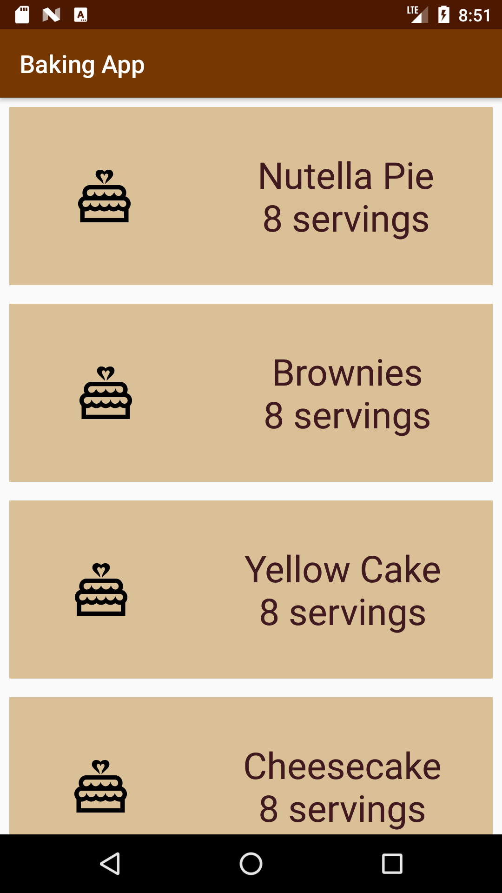
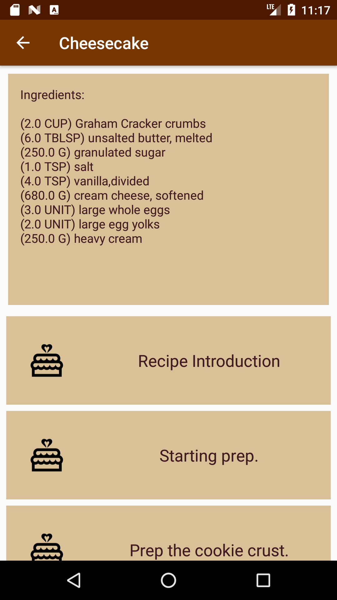
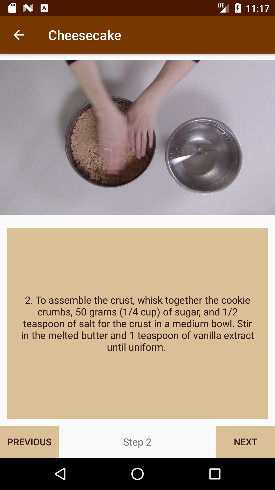
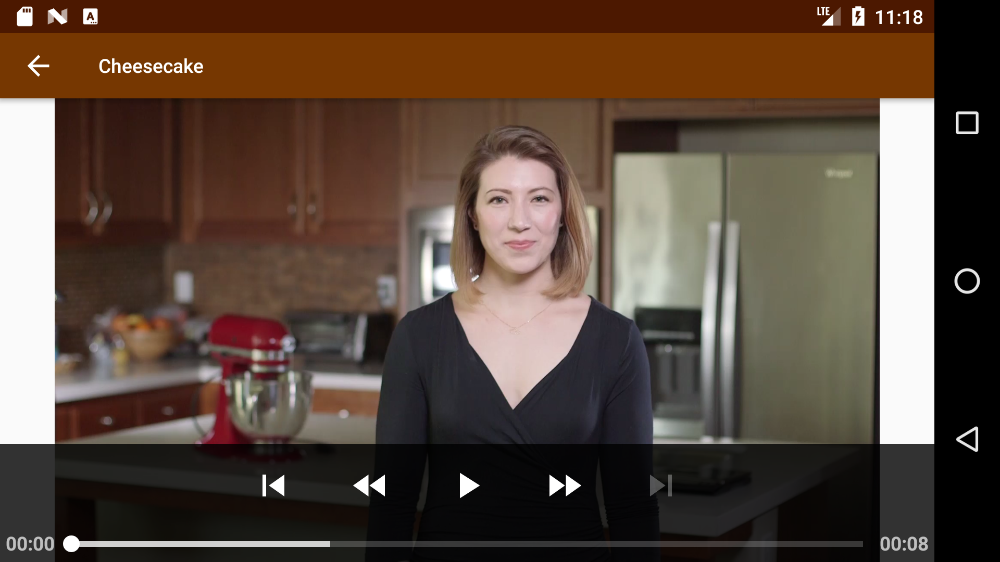
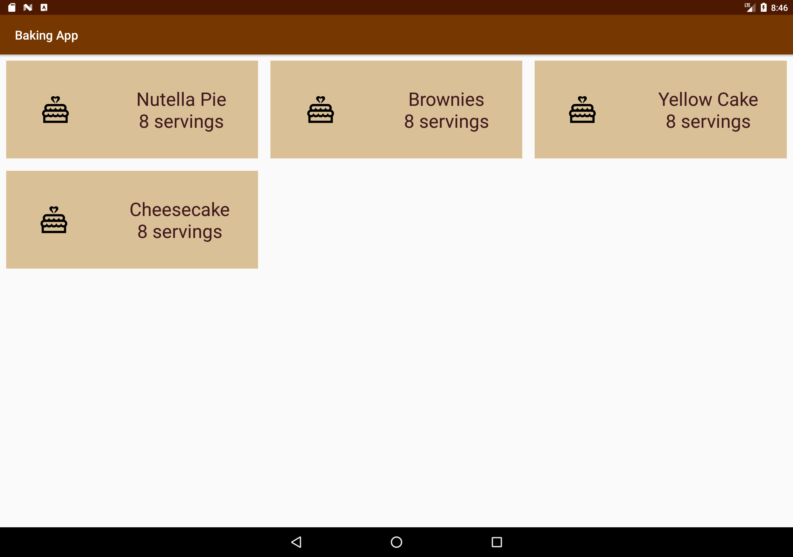
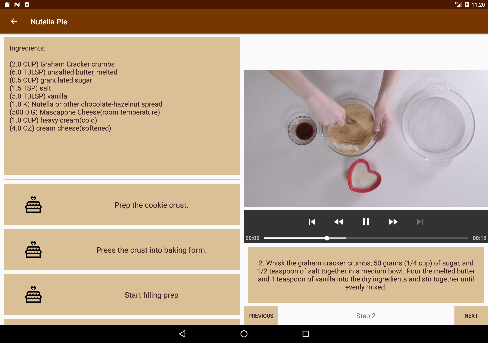

# Baking App
Android Developer Nanodegree project that shares recipes and shows step-by-step videos

## App Features
* View a list of baking recipes and select one to follow
* View ingredients and list of steps to complete recipe
* Follow recipe instructions with accompanying videos
* Add a widget to home screen to view ingredients of last opened recipe

## Concepts Applied
* JSON parsing with a given URL
* RecyclerView with accompanying Adapters, ViewHolders, and LayoutManagers
* Third-parties libraries like ButterKnife and Picasso
* Media playback with ExoPlayer
* Master Detail Activity flows with use of Fragments
* UI testing with Espresso
* Widgets and WidgetProviders

## Phone Screenshots

## Tablet Screenshots

